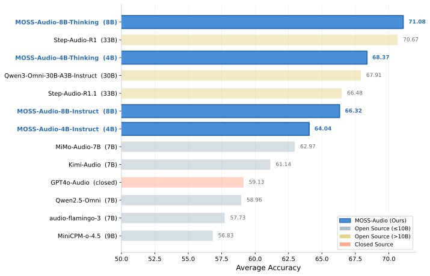

# MOSS-Audio


<p align="center">
  
</p>


<div align="center">
  <a href="https://huggingface.co/collections/OpenMOSS-Team/moss-audio"></a>
  
  

  <a href="https://x.com/Open_MOSS"></a>
  <a href="https://discord.gg/Xf3aXddCjc"></a>
  <a href="./assets/wechat.png"></a>
</div>

<p align="center">
  <a href="./README.md">English</a> | <a href="./README_zh.md">简体中文</a>
</p>


MOSS-Audio is an open-source **audio understanding model** from [MOSI.AI](https://mosi.cn/#hero), the [OpenMOSS team](https://www.open-moss.com/), and [Shanghai Innovation Institute](https://www.sii.edu.cn/). It performs unified modeling over complex real-world audio, supporting **speech understanding, environmental sound understanding, music understanding, audio captioning, time-aware QA, and complex reasoning**. In this release, we provide **four models**: **MOSS-Audio-4B-Instruct**, **MOSS-Audio-4B-Thinking**, **MOSS-Audio-8B-Instruct**, and **MOSS-Audio-8B-Thinking**. The Instruct variants are optimized for direct instruction following, while the Thinking variants provide stronger chain-of-thought reasoning capabilities.


## News
* 2026.4.13: 🎉🎉🎉 We have released [MOSS-Audio](https://huggingface.co/collections/OpenMOSS-Team/moss-audio). Blog and paper coming soon!


## Contents

- [Introduction](#introduction)
- [Model Architecture](#model-architecture)
  - [DeepStack Cross-Layer Feature Injection](#deepstack-cross-layer-feature-injection)
  - [Time-Aware Representation](#time-aware-representation)
- [Released Models](#released-models)
- [Evaluation](#evaluation)
- [Quickstart](#quickstart)
  - [Environment Setup](#environment-setup)
  - [Basic Usage](#basic-usage)
  - [Gradio App](#gradio-app)
  - [SGLang Serving](#sglang-serving)
- [More Information](#more-information)
- [Citation](#citation)


## Introduction

<p align="center">
  
</p>


Understanding audio requires more than simply transcribing words — it demands the ability to perceive acoustic cues, recognize speakers and emotions, interpret environmental sounds, reason over temporal context, and handle complex multi-step inference. **MOSS-Audio** is built to unify these capabilities within a single model.

- **Speech & Content Understanding**: Accurately recognizes and transcribes spoken content from audio inputs, producing clean and well-structured text outputs. Supports both word-level and sentence-level timestamp alignment.
- **Speaker, Emotion & Event Analysis**: Identifies speaker characteristics, analyzes emotional states based on tone, timbre, and context, and detects key acoustic events within the audio.
- **Scene & Sound Cue Extraction**: Extracts meaningful cues from background sounds, environmental noise, music, and non-speech signals to infer scene context and atmosphere.
- **Music Understanding**: Analyzes musical style, emotional progression, instrumentation, and salient acoustic features in music segments.
- **Audio Question Answering & Summarization**: Answers questions and generates summaries about speech, podcasts, meetings, interviews, and environmental recordings, helping users efficiently extract key information.
- **Time-Aware QA**: Supports time-aware questions, including word-level and sentence-level timestamp ASR.
- **Complex Reasoning**: Performs multi-hop reasoning over audio content, powered by chain-of-thought training and reinforcement learning.

## Model Architecture

<p align="center">
  
</p>

MOSS-Audio follows a modular design comprising three components: an audio encoder, a modality adapter, and a large language model. Raw audio is first encoded by **MOSS-Audio-Encoder** into continuous temporal representations at **12.5 Hz**, which are then projected into the language model's embedding space through the adapter and finally consumed by the LLM for auto-regressive text generation. 

Rather than relying on off-the-shelf audio frontends, we train a dedicated encoder from scratch to obtain more robust speech representations, tighter temporal alignment, and better extensibility across acoustic domains.


### DeepStack Cross-Layer Feature Injection

Using only the encoder's top-layer features tends to lose low-level prosody, transient events, and local time-frequency structure. To address this, we design a **DeepStack**-inspired cross-layer injection module between the encoder and the language model: in addition to the encoder's final-layer output, features from earlier and intermediate layers are selected, independently projected, and injected into the language model's early layers, preserving multi-granularity information from low-level acoustic details to high-level semantic abstractions.

This design is especially well-suited for audio understanding tasks, as it helps retain rhythm, timbre, transients, and background structure — information that a single high-level representation cannot fully capture.

### Time-Aware Representation

Time is a critical dimension in audio understanding. To enhance explicit temporal awareness, we adopt a **time-marker insertion** strategy during pretraining: explicit time tokens are inserted between audio frame representations at fixed time intervals to indicate temporal positions. This design enables the model to learn "what happened when" within a unified text generation framework, naturally supporting timestamp ASR, event localization, time-based QA, and long-audio retrospection.


## Released Models


| Model | Audio Encoder | LLM Backbone | Total Size | Hugging Face | ModelScope |
|---|---|---|---:|---|---|
| **MOSS-Audio-4B-Instruct** | MOSS-Audio-Encoder | Qwen3-4B | ~4.6B | [](https://huggingface.co/OpenMOSS-Team/MOSS-Audio-4B-Instruct) | [](https://modelscope.cn/models/openmoss/MOSS-Audio-4B-Instruct) |
| **MOSS-Audio-4B-Thinking** | MOSS-Audio-Encoder | Qwen3-4B | ~4.6B | [](https://huggingface.co/OpenMOSS-Team/MOSS-Audio-4B-Thinking) | [](https://modelscope.cn/models/openmoss/MOSS-Audio-4B-Thinking) |
| **MOSS-Audio-8B-Instruct** | MOSS-Audio-Encoder | Qwen3-8B | ~8.6B | [](https://huggingface.co/OpenMOSS-Team/MOSS-Audio-8B-Instruct) | [](https://modelscope.cn/models/openmoss/MOSS-Audio-8B-Instruct) |
| **MOSS-Audio-8B-Thinking** | MOSS-Audio-Encoder | Qwen3-8B | ~8.6B | [](https://huggingface.co/OpenMOSS-Team/MOSS-Audio-8B-Thinking) | [](https://modelscope.cn/models/openmoss/MOSS-Audio-8B-Thinking) |

> More model families, sizes, and variants will be released in the future. Stay tuned!


## Evaluation

We evaluate MOSS-Audio on a comprehensive set of audio understanding benchmarks. Key results:

- **General Audio Understanding**: MOSS-Audio-8B-Thinking achieves an average accuracy of **71.08**, with **77.33** on MMAU, **64.92** on MMAU-Pro, **66.53** on MMAR, and **75.52** on MMSU, outperforming all open-source models.
- **Speech Captioning**: MOSS-Audio-Instruct variants lead across **11 out of 13** fine-grained speech description dimensions, with **MOSS-Audio-8B-Instruct** achieving the best overall average score (**3.7252**).
- **ASR**: On a diverse ASR benchmark suite spanning 12 evaluation dimensions, MOSS-Audio achieves the **lowest overall CER (11.30)**, with particular strength in health-condition, code-switching, dialect, singing, and non-speech scenarios.
- **Timestamp ASR**: MOSS-Audio-8B-Instruct achieves **35.77 AAS** on AISHELL-1 and **131.61 AAS** on LibriSpeech, dramatically outperforming Qwen3-Omni (833.66) and Gemini-3.1-Pro (708.24) in timestamp asr accuracy.

### General Audio Understanding (Accuracy↑)

<p align="center">
  
</p>

<table>
  <thead>
    <tr>
      <th>Model</th>
      <th>Model Size</th>
      <th>MMAU</th>
      <th>MMAU-Pro</th>
      <th>MMAR</th>
      <th>MMSU</th>
      <th>Avg</th>
    </tr>
  </thead>
  <tbody>
    <tr><td colspan="7"><em><strong>Open Source (small)</strong></em></td></tr>
    <tr>
      <td>Kimi-Audio</td><td>7B</td><td>72.41</td><td>56.58</td><td>60.82</td><td>54.74</td><td>61.14</td>
    </tr>
    <tr>
      <td>Qwen2.5-Omni</td><td>7B</td><td>65.60</td><td>52.20</td><td>56.70</td><td>61.32</td><td>58.96</td>
    </tr>
    <tr>
      <td>Audio Flamingo 3</td><td>7B</td><td>61.23</td><td>51.70</td><td>57.96</td><td>60.04</td><td>57.73</td>
    </tr>
    <tr>
      <td>MiMo-Audio-7B</td><td>7B</td><td>74.90</td><td>53.35</td><td>61.70</td><td>61.94</td><td>62.97</td>
    </tr>
    <tr>
      <td>MiniCPM-o-4.5</td><td>9B</td><td>70.97</td><td>39.65</td><td>55.75</td><td>60.96</td><td>56.83</td>
    </tr>
    <tr>
      <td><strong>MOSS-Audio-4B-Instruct</strong></td><td><strong>4B</strong></td><td>75.79</td><td>58.16</td><td>59.68</td><td>59.68</td><td>64.04</td>
    </tr>
    <tr>
      <td><strong>MOSS-Audio-4B-Thinking</strong></td><td><strong>4B</strong></td><td><strong>77.64</strong></td><td>60.75</td><td>63.91</td><td>71.20</td><td>68.37</td>
    </tr>
    <tr>
      <td><strong>MOSS-Audio-8B-Instruct</strong></td><td><strong>8B</strong></td><td>77.03</td><td>57.48</td><td>64.42</td><td>66.36</td><td>66.32</td>
    </tr>
    <tr>
      <td><strong>MOSS-Audio-8B-Thinking</strong></td><td><strong>8B</strong></td><td><strong>77.33</strong></td><td><strong>64.92</strong></td><td><strong>66.53</strong></td><td><strong>75.52</strong></td><td><strong>71.08</strong></td>
    </tr>
    <tr><td colspan="7"><em><strong>Open Source (large)</strong></em></td></tr>
    <tr>
      <td>Qwen3-Omni-30B-A3B-Instruct</td><td>30B</td><td>75.00</td><td><strong>61.22</strong></td><td>66.40</td><td>69.00</td><td>67.91</td>
    </tr>
    <tr>
      <td>Step-Audio-R1.1</td><td>33B</td><td>72.18</td><td>60.80</td><td>68.75</td><td>64.18</td><td>66.48</td>
    </tr>
    <tr>
      <td>Step-Audio-R1</td><td>33B</td><td><strong>78.67</strong></td><td>59.68</td><td><strong>69.15</strong></td><td><strong>75.18</strong></td><td><strong>70.67</strong></td>
    </tr>
    <tr><td colspan="7"><em><strong>Closed Source</strong></em></td></tr>
    <tr>
      <td>GPT4o-Audio</td><td>-</td><td>65.66</td><td>52.30</td><td>59.78</td><td>58.76</td><td>59.13</td>
    </tr>
    <tr>
      <td>Gemini-3-Pro</td><td>-</td><td>80.15</td><td>68.28</td><td>81.73</td><td>81.28</td><td>77.86</td>
    </tr>
    <tr>
      <td>Gemini-3.1-Pro</td><td>-</td><td><strong>81.10</strong></td><td><strong>73.47</strong></td><td><strong>83.70</strong></td><td><strong>81.30</strong></td><td><strong>79.89</strong></td>
    </tr>
  </tbody>
</table>

### Speech Captioning (LLM-as-a-Judge Score↑)

<p align="center">
  
</p>

<details>
<summary><strong>Speech Captioning (click to expand)</strong></summary>


| Model | gender | age | accent | pitch | volume | speed | texture | clarity | fluency | emotion | tone | personality | summary | Avg |
|---|---:|---:|---:|---:|---:|---:|---:|---:|---:|---:|---:|---:|---:|---:|
| Qwen3-Omni-30B-A3B-Instruct | 4.436 | 3.936 | 4.356 | 3.590 | 3.682 | 3.614 | 3.093 | 3.521 | 3.531 | 3.328 | 3.224 | 3.292 | 3.179 | 3.5986 |
| Qwen3-Omni-30B-A3B-Thinking | 4.419 | **4.026** | 4.327 | 3.610 | 3.577 | 3.610 | 3.179 | 3.403 | 3.526 | 3.232 | 3.154 | 3.197 | 3.107 | 3.5667 |
| Gemini-3-Pro | 4.191 | 3.835 | 4.181 | 3.392 | 3.254 | 3.320 | 2.998 | 3.347 | 3.524 | 3.055 | 2.997 | 3.023 | 2.775 | 3.3763 |
| Gemini-3.1-Pro| 4.436 | 3.936 | 4.356 | 3.590 | 3.682 | 3.614 | 3.093 | 3.521 | 3.531 | **3.328** | 3.224 | 3.292 | 3.179 | 3.5986 |
| MOSS-Audio-4B-Instruct | **4.697** | 3.980 | 4.497 | 3.628 | **3.722** | 3.564 | **3.407** | 3.841 | 3.744 | 3.311 | **3.282** | **3.305** | 3.259 | 3.7105 |
| MOSS-Audio-8B-Instruct | 4.683 | 3.979 | **4.572** | **3.682** | 3.709 | **3.638** | 3.403 | **3.869** | **3.747** | 3.314 | 3.253 | 3.272 | **3.307** | **3.7252** |

</details>

### ASR 

| Model | Overall | Health Condition | Dialect | Singing | Non-Speech Vocalizations | Code-Switching | Acoustic Environment (Clean) | Acoustic Environment (Noisy) | Acoustic Characteristics: Whisper | Acoustic Characteristics: Far-Field / Near-Field | Multi-Speaker | Age | Semantic Content |
|---|---:|---:|---:|---:|---:|---:|---:|---:|---:|---:|---:|---:|---:|
| Paraformer-Large | 15.77 | 22.18 | 43.45 | 32.34 | 4.95 | 12.65 | 3.11 | 4.67 | 5.02 | 17.46 | 20.33 | 14.96 | 7.14 |
| GLM-ASR-Nano | 17.29 | 24.49 | 22.39 | 51.95 | 4.65 | 11.88 | 3.68 | 5.02 | 4.94 | 27.51 | 28.02 | 17.19 | 7.32 |
| Fun-ASR-Nano | 12.04 | 21.99 | 7.80 | 19.35 | 4.76 | 11.23 | 2.98 | 3.46 | 3.78 | 18.38 | 19.82 | **14.95** | 6.08 |
| SenseVoice-Small | 14.50 | 24.04 | 8.89 | 23.79 | 4.92 | 13.90 | 4.13 | 4.93 | 5.57 | 26.66 | 24.06 | 17.63 | 7.55 |
| Kimi-Audio-7B-Instruct | 14.12 | 21.11 | 29.34 | 21.76 | 4.68 | 16.38 | **2.20** | **2.15** | 2.66 | 21.02 | 20.61 | 16.74 | 6.12 |
| Qwen2.5-Omni-3B | 15.26 | 24.65 | 33.87 | 24.24 | 5.54 | 11.66 | 2.76 | 3.56 | 4.32 | 22.15 | 22.91 | 15.17 | 7.24 |
| Qwen2.5-Omni-7B | 15.05 | 23.85 | 31.91 | 22.69 | 4.56 | 12.97 | 2.52 | 3.16 | 3.64 | 25.38 | 21.01 | 16.13 | 6.78 |
| Qwen3-Omni-30B-A3B-Instruct | 11.39 | 20.73 | 15.63 | 16.01 | 4.73 | 11.30 | 2.23 | 2.47 | **1.90** | **17.08** | **18.15** | **11.46** | **5.74** |
| **MOSS-Audio-4B-Instruct** | 11.58 | 21.11 | 11.84 | 10.79 | **4.01** | **10.11** | 3.11 | 3.72 | 3.29 | 18.48 | 20.33 | 15.09 | 8.15 |
| **MOSS-Audio-8B-Instruct** | **11.30** | **19.18** | **8.76** | **9.81** | 4.31 | 10.18 | 2.70 | 3.20 | 2.75 | 24.04 | 24.36 | 15.26 | 7.69 |

<details>
<summary><strong>Detailed ASR Results (click to expand)</strong></summary>

<table>
  <tr>
    <th rowspan="2">Model</th>
    <th colspan="3">Acoustic Environment (Clean)</th>
    <th colspan="1">Acoustic Environment (Noisy)</th>
    <th colspan="1">Acoustic Characteristics: Whisper</th>
    <th colspan="1">Acoustic Characteristics: Far-Field / Near-Field</th>
    <th colspan="1">Multi-Speaker</th>
    <th colspan="2">Age</th>
    <th colspan="2">Health Condition</th>
    <th colspan="2">Semantic Content</th>
    <th colspan="3">Code-Switching</th>
    <th colspan="2">Dialect</th>
    <th colspan="2">Singing</th>
    <th colspan="1">Non-Speech Vocalizations</th>
  </tr>
  <tr>
    <th>AISHELL-1<br><em>test</em></th>
    <th>AISHELL-2<br><em>Android | IOS | Mic</em></th>
    <th>THCHS-30<br><em>test</em></th>
    <th>MAGICDATA-READ<br><em>test</em></th>
    <th>AISHELL6-Whisper<br><em>normal | whisper</em></th>
    <th>AliMeeting<br><em>Test_Ali_far | Test_Ali_near</em></th>
    <th>AISHELL-4<br><em>test</em></th>
    <th>SeniorTalk<br><em>sentence</em></th>
    <th>ChildMandarin<br><em>test</em></th>
    <th>AISHELL-6A<br><em>mild | moderate | severe | StutteringSpeech</em></th>
    <th>AISHELL_6B<br><em>LRDWWS | Uncontrol</em></th>
    <th>WenetSpeech<br><em>test-meeting</em></th>
    <th>Fleurs<br><em>cmn_hans_cn</em></th>
    <th>CS-Dialogue<br><em>test</em></th>
    <th>TALCS<br><em>test</em></th>
    <th>ASCEND<br><em>test</em></th>
    <th>KeSpeech<br><em>test</em></th>
    <th>WSYue-ASR-eval<br><em>short</em></th>
    <th>MIR-1K<br><em>test</em></th>
    <th>openc-pop<br><em>test</em></th>
    <th>MNV_17</th>
  </tr>
  <tr>
    <td>Paraformer-Large</td>
    <td>1.98</td>
    <td>3.28 | 3.21 | 3.00</td>
    <td>4.07</td>
    <td>4.67</td>
    <td>1.11 | 8.92</td>
    <td><strong>25.64</strong> | 9.27</td>
    <td>20.33</td>
    <td>17.31</td>
    <td>12.60</td>
    <td>6.98 | 9.30 | 13.34 | 10.74</td>
    <td>47.59 | 45.08</td>
    <td>7.88</td>
    <td>6.40</td>
    <td>10.64</td>
    <td>10.77</td>
    <td>16.55</td>
    <td>11.48</td>
    <td>75.42</td>
    <td>57.70</td>
    <td>6.98</td>
    <td>4.95</td>
  </tr>
  <tr>
    <td>GLM-ASR-Nano</td>
    <td>2.89</td>
    <td>3.75 | 3.73 | 3.78</td>
    <td>4.23</td>
    <td>5.02</td>
    <td>0.83 | 9.06</td>
    <td>40.27 | 14.76</td>
    <td>28.02</td>
    <td>20.33</td>
    <td>14.06</td>
    <td>8.74 | 12.11 | 14.38 | 12.29</td>
    <td>50.34 | 49.09</td>
    <td>9.70</td>
    <td>4.94</td>
    <td>11.06</td>
    <td>11.07</td>
    <td>13.50</td>
    <td>9.72</td>
    <td>35.07</td>
    <td>95.87</td>
    <td>8.03</td>
    <td>4.65</td>
  </tr>
  <tr>
    <td>Fun-ASR-Nano</td>
    <td>2.16</td>
    <td>3.04 | 2.99 | 3.07</td>
    <td>3.65</td>
    <td>3.46</td>
    <td>0.81 | 6.76</td>
    <td>27.21 | 9.55</td>
    <td>19.82</td>
    <td>16.96</td>
    <td>12.94</td>
    <td>6.60 | <strong>8.81</strong> | 12.98 | 10.30</td>
    <td>47.42 | 45.84</td>
    <td>7.39</td>
    <td><strong>4.76</strong></td>
    <td>10.47</td>
    <td><strong>8.09</strong></td>
    <td>15.13</td>
    <td>7.43</td>
    <td>8.17</td>
    <td>35.85</td>
    <td>2.84</td>
    <td>4.76</td>
  </tr>
  <tr>
    <td>SenseVoice-Small</td>
    <td>3.23</td>
    <td>4.16 | 4.02 | 3.96</td>
    <td>5.26</td>
    <td>4.93</td>
    <td>1.25 | 9.88</td>
    <td>37.01 | 16.31</td>
    <td>24.06</td>
    <td>21.07</td>
    <td>14.18</td>
    <td>7.62 | 9.85 | 14.39 | 11.47</td>
    <td>52.92 | 47.97</td>
    <td>8.35</td>
    <td>6.75</td>
    <td>12.81</td>
    <td>10.52</td>
    <td>18.38</td>
    <td>10.45</td>
    <td><strong>7.34</strong></td>
    <td>39.51</td>
    <td>8.07</td>
    <td>4.92</td>
  </tr>
  <tr>
    <td>Kimi-Audio-7B-Instruct</td>
    <td><strong>0.79</strong></td>
    <td>2.91 | 3.03 | 2.88</td>
    <td><strong>1.39</strong></td>
    <td><strong>2.15</strong></td>
    <td>0.69 | 4.63</td>
    <td>28.22 | 13.82</td>
    <td>20.61</td>
    <td>19.70</td>
    <td>13.79</td>
    <td>7.00 | 9.34 | 12.56 | 10.75</td>
    <td>44.44 | 42.57</td>
    <td>7.15</td>
    <td>5.10</td>
    <td>14.56</td>
    <td>12.74</td>
    <td>21.83</td>
    <td><strong>5.51</strong></td>
    <td>53.17</td>
    <td>38.35</td>
    <td>5.17</td>
    <td>4.68</td>
  </tr>
  <tr>
    <td>Qwen2.5-Omni-3B</td>
    <td>1.51</td>
    <td>3.10 | 2.94 | 2.93</td>
    <td>3.32</td>
    <td>3.56</td>
    <td>0.82 | 7.82</td>
    <td>32.14 | 12.16</td>
    <td>22.91</td>
    <td>17.38</td>
    <td>12.96</td>
    <td>6.87 | 10.55 | 14.57 | 11.33</td>
    <td>54.54 | 50.03</td>
    <td>9.04</td>
    <td>5.45</td>
    <td>10.78</td>
    <td>10.94</td>
    <td>13.25</td>
    <td>7.67</td>
    <td>60.06</td>
    <td>45.00</td>
    <td>3.47</td>
    <td>5.54</td>
  </tr>
  <tr>
    <td>Qwen2.5-Omni-7B</td>
    <td>1.16</td>
    <td>2.88 | 2.77 | 2.73</td>
    <td>3.06</td>
    <td>3.16</td>
    <td>0.71 | 6.57</td>
    <td>32.03 | 18.73</td>
    <td>21.01</td>
    <td>19.96</td>
    <td>12.29</td>
    <td>7.27 | 10.94 | 12.92 | 10.53</td>
    <td>51.99 | 49.45</td>
    <td>8.43</td>
    <td>5.13</td>
    <td>14.02</td>
    <td>10.46</td>
    <td>14.42</td>
    <td>6.40</td>
    <td>57.43</td>
    <td>42.62</td>
    <td>2.75</td>
    <td>4.56</td>
  </tr>
  <tr>
    <td>Qwen3-Omni-30B-A3B-Instruct</td>
    <td>0.95</td>
    <td><strong>2.70</strong> | <strong>2.72</strong> | <strong>2.57</strong></td>
    <td>2.21</td>
    <td>2.47</td>
    <td><strong>0.59</strong> | <strong>3.22</strong></td>
    <td>25.72 | <strong>8.44</strong></td>
    <td><strong>18.15</strong></td>
    <td><strong>14.13</strong></td>
    <td><strong>8.79</strong></td>
    <td>6.20 | 8.88 | 11.59 | 10.25</td>
    <td>45.80 | 41.65</td>
    <td><strong>6.64</strong></td>
    <td>4.84</td>
    <td>12.94</td>
    <td>8.33</td>
    <td><strong>12.64</strong></td>
    <td>5.87</td>
    <td>25.39</td>
    <td>30.81</td>
    <td><strong>1.21</strong></td>
    <td>4.73</td>
  </tr>
  <tr>
    <td><strong>MOSS-Audio-4B-Instruct</strong></td>
    <td>2.26</td>
    <td>3.22 | 3.20 | 3.33</td>
    <td>3.53</td>
    <td>3.72</td>
    <td>0.73 | 5.86</td>
    <td>27.27 | 9.68</td>
    <td>20.33</td>
    <td>16.93</td>
    <td>13.25</td>
    <td>6.36 | 9.77 | 12.68 | 10.28</td>
    <td>43.35 | 44.25</td>
    <td>8.17</td>
    <td>8.13</td>
    <td>9.14</td>
    <td>8.37</td>
    <td>12.83</td>
    <td>14.65</td>
    <td>9.04</td>
    <td>18.47</td>
    <td>3.10</td>
    <td><strong>4.01</strong></td>
  </tr>
  <tr>
    <td><strong>MOSS-Audio-8B-Instruct</strong></td>
    <td>1.82</td>
    <td>2.97 | 2.95 | 2.91</td>
    <td>2.82</td>
    <td>3.20</td>
    <td>0.69 | 4.80</td>
    <td>36.82 | 11.25</td>
    <td>24.36</td>
    <td>17.42</td>
    <td>13.10</td>
    <td><strong>5.84</strong> | 8.94 | <strong>11.52</strong> | <strong>9.72</strong></td>
    <td><strong>39.76</strong> | <strong>39.27</strong></td>
    <td>7.86</td>
    <td>7.52</td>
    <td><strong>9.07</strong></td>
    <td>8.22</td>
    <td>13.26</td>
    <td>9.18</td>
    <td>8.33</td>
    <td><strong>17.24</strong></td>
    <td>2.39</td>
    <td>4.31</td>
  </tr>
</table>

</details>


### Timestamp ASR (AAS↓)

| Model | AISHELL-1(zh)  | LibriSpeech(en) |
|---|---:|---:|
| Qwen3-Omni-30B-A3B-Instruct | 833.66 | 646.95 |
| Gemini-3.1-Pro| 708.24 | 871.19 |
| MOSS-Audio-4B-Instruct | 76.96 | 358.13 |
| **MOSS-Audio-8B-Instruct** | **35.77** | **131.61** |


## Quickstart

### Environment Setup

We recommend Python 3.12 with a clean Conda environment. The commands below are enough for local inference.

#### Recommended setup

```bash
git clone https://github.com/OpenMOSS/MOSS-Audio.git
cd MOSS-Audio

conda create -n moss-audio python=3.12 -y
conda activate moss-audio

conda install -c conda-forge "ffmpeg=7" -y
pip install --extra-index-url https://download.pytorch.org/whl/cu128 -e ".[torch-runtime]"
```

#### Optional: FlashAttention 2

If your GPU supports FlashAttention 2, you can replace the last install command with:

```bash
pip install --extra-index-url https://download.pytorch.org/whl/cu128 -e ".[torch-runtime,flash-attn]"
```


### Basic Usage

Download the model first:

```bash
huggingface-cli download OpenMOSS-Team/MOSS-Audio --local-dir ./weights/MOSS-Audio
huggingface-cli download OpenMOSS-Team/MOSS-Audio-Instruct --local-dir ./weights/MOSS-Audio-Instruct
```

Then edit `MODEL_PATH` / `AUDIO_PATH` in `infer.py` as needed, and run:

```bash
python infer.py
```

The default prompt in `infer.py` is `Describe this audio.` You can directly edit that line if you want to try transcription, audio QA, or speech captioning.

### Gradio App

Start the Gradio demo with:

```bash
python app.py
```


### SGLang Serving

If you want to serve MOSS-Audio with SGLang, see the full guide in `moss_audio_usage_guide.md`.

The shortest setup is:

```bash
git clone -b moss-audio https://github.com/OpenMOSS/sglang.git
cd sglang
pip install -e "python[all]"
pip install nvidia-cudnn-cu12==9.16.0.29
cd ..
sglang serve --model-path ./weights/MOSS-Audio --trust-remote-code
```

If you use the default `torch==2.9.1+cu128` runtime, installing `nvidia-cudnn-cu12==9.16.0.29` is recommended before starting `sglang serve`.


<a id="more-information"></a>

## More Information
- **MOSI.AI**: [https://mosi.cn](https://mosi.cn)
- **OpenMOSS**: [https://www.open-moss.com](https://www.open-moss.com)


## LICENSE

Models in MOSS-Audio are licensed under the Apache License 2.0.


## Citation

```bibtex
@misc{mossaudio2026,
      title={MOSS-Audio Technical Report},
      author={OpenMOSS Team},
      year={2026},
      howpublished={\url{https://github.com/OpenMOSS/MOSS-Audio}},
      note={GitHub repository}
}
```

## Star History

[](https://www.star-history.com/#OpenMOSS/MOSS-Audio&type=date&legend=top-left)
